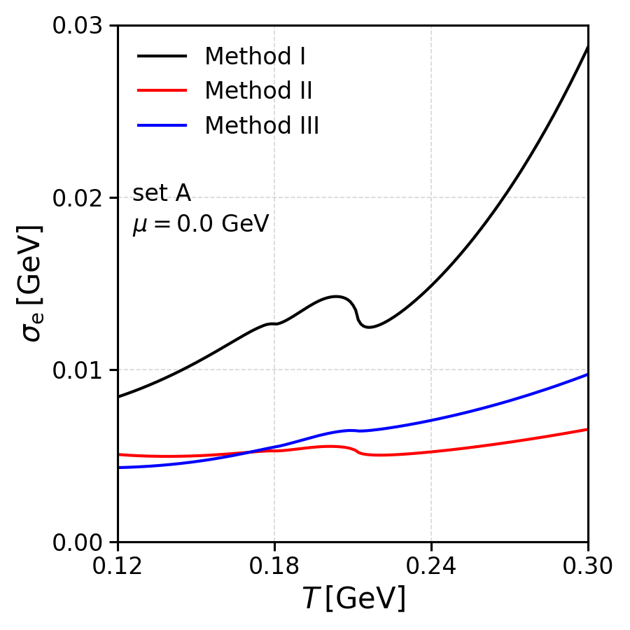
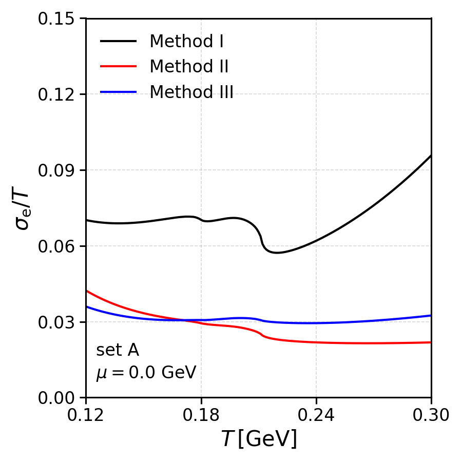
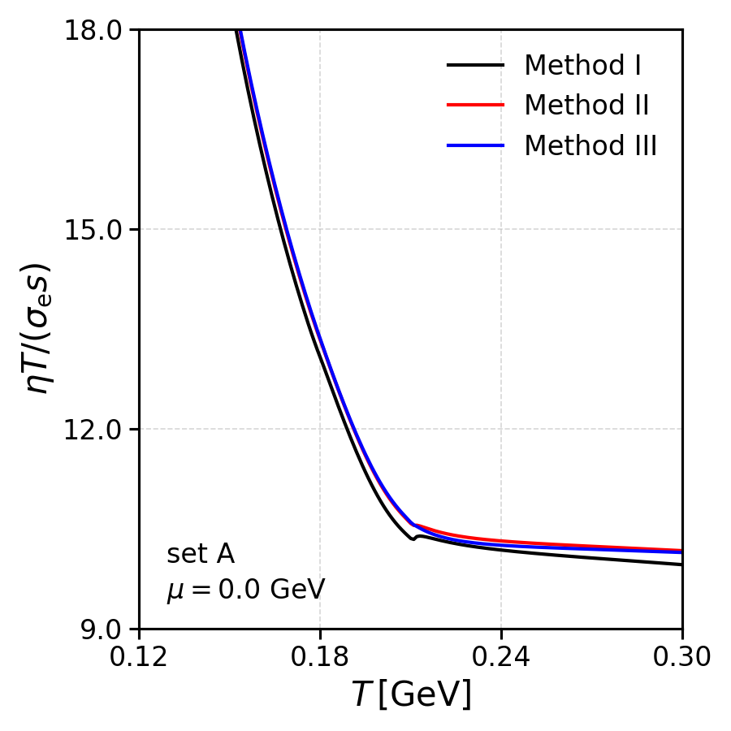
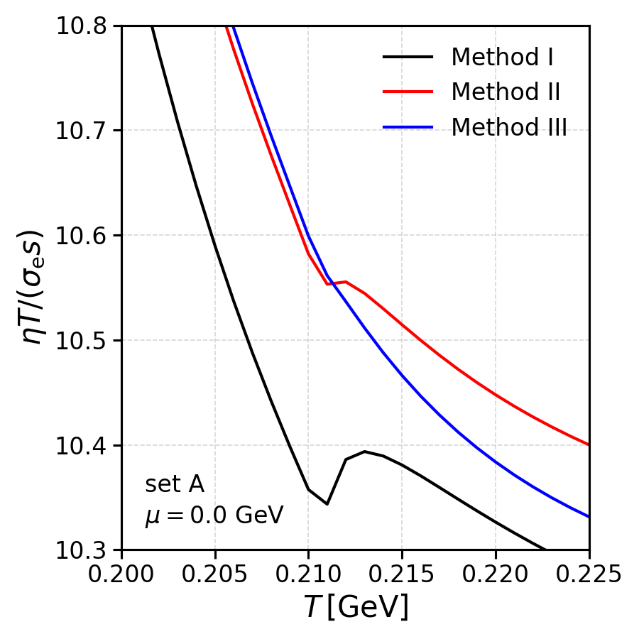
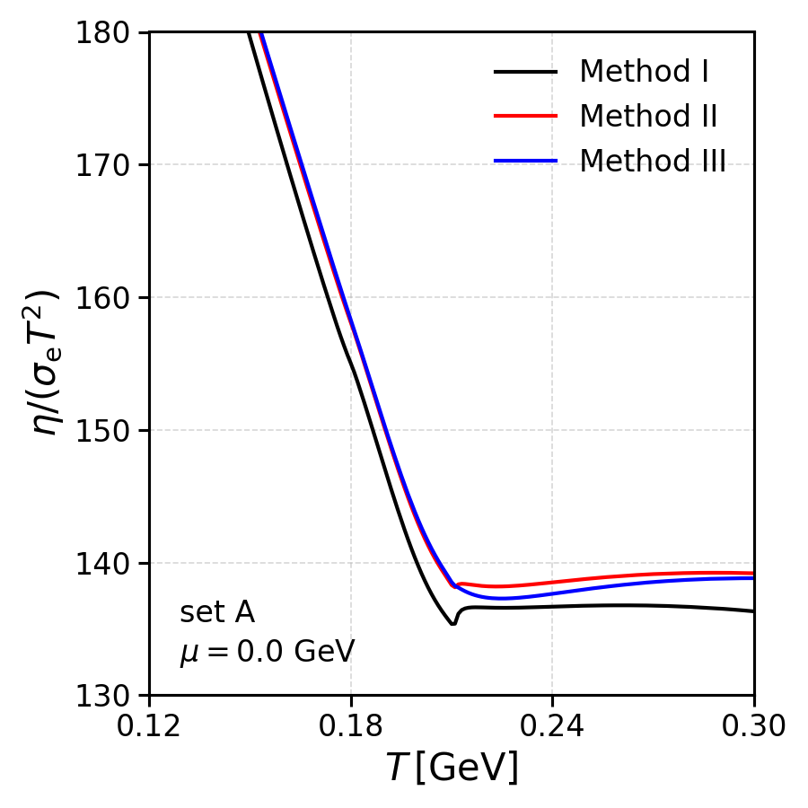
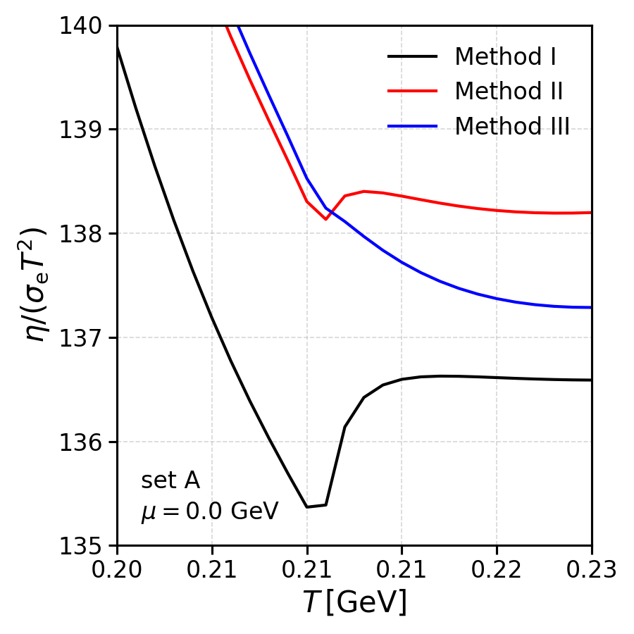

# Nambu-Jona-Lasinio model in the mean field approximation

**THIS FILE IS A WORK IN PROGRESS...**

This project provides computational tools for studying the Nambu–Jona-Lasinio (NJL) model in the mean-field approximation. The Lagrangian density of the model can be written as:
$$
\mathcal{L} [ \psi, \bar{\psi} ] =  \bar{\psi} ( i \gamma^\mu \partial_\mu - \hat{m} ) \psi + 
\mathcal{L}_\mathrm{int} [\psi, \bar{\psi} ]
$$

Here, $\psi$ is the quark field and $\hat{m}= \mathrm{diag}  \{ m_1, m_2, \ldots , m_{N_f} \} $ is the quark current mass matrix (with $N_f$ the number of quark flavors). The different quark-quark interactions are contained in the term $\mathcal{L}_\mathrm{int} [\psi, \bar{\psi} ]$ and, for our purposes, its exact definite form is not important. This interaction term includes the dynamical chiral symmetry breaking 4-quark scalar-pseudoscalar interaction, $\mathcal{L} \supset (\bar{\psi} \lambda_a \psi)^2 + (\bar{\psi} i \gamma_5 \lambda_a \psi)^2$, but it also includes other multi-quark interactions, like the 't Hooft determinant, eight quark-quark interactions, explicit chiral symmetry breaking interactions, vector interactions, etc (in these interaction terms, $\lambda_a$ are the generators of the $U(N_f)$ algebra).


The code allows for numerical investigations of several properties of the model, including:
- calculation of quark effective masses at finite temperature and baryon density;
- calculation of meson masses at finite temperature and baryon density (to be completed);
- calculation of the NJL model phase diagram at finite temperature and chemical potential;


# How to build and run

Compile main code:
```bash
make
# or, using parallel computing,
make -j$(nproc)
```
to clean the artifacts, use:
```bash
make clean
```

To test the `ini_file_parser` module, one can execute the `execute_tests.sh` script present in that folder. For that, use:
```bash
(cd tests/ini_file_parser/ && ./execute_tests.sh)
```

To test the `integration_methods` module, one can execute the `execute_tests.sh` script present in the folder `tests/integration_methods/`. For that, use:
```bash
(cd tests/integration_methods/ && ./execute_tests.sh)
```

To test the `gsl_wrapper` module, one can execute the `execute_tests.sh` script present in the folder `tests/gsl_wrapper/`. For that, use:
```bash
(cd tests/gsl_wrapper/ && ./execute_tests.sh)
```

# Calculations

## B0 Integral Study (two_fermion_line_integral_3d_cutoff)
```bash
(cd calculations/two_fermion_line_integral_3d_cutoff && ./execute_calculations.sh)
(cd calculations/two_fermion_line_integral_3d_cutoff && ./build_plots.sh)
```

## SU3 NJL Vacuum Study (su3_3d_cutoff_vacuum_masses)

### Vacuum Masses with and without 8q interactions
```bash
(cd calculations/su3_3d_cutoff_vacuum_masses && ./execute_calculations.sh)
```

## SU3 NJL Phase Diagram Study (su3_3d_cutoff_phase_diagram)
```bash
(cd calculations/su3_3d_cutoff_phase_diagram && ./execute_calculations.sh)
(cd calculations/su3_3d_cutoff_phase_diagram && ./build_plots.sh)
```

## SU3 NJL Cross Section Study 

### Klevansky parameter set (su3_3d_cutoff_cross_sections_klevansky)
```bash
(cd calculations/su3_3d_cutoff_cross_sections_klevansky && ./execute_calculations.sh)
(cd calculations/su3_3d_cutoff_cross_sections_klevansky && ./build_plots.sh)
```

## SU3 NJL Integrated Cross Section Study (su3_3d_cutoff_int_cross_sections)
```bash
(cd calculations/su3_3d_cutoff_int_cross_sections/zero_chem_pot && ./execute_calculations_COMPLETE_COV.sh)
(cd calculations/su3_3d_cutoff_int_cross_sections/zero_chem_pot && ./execute_calculations_KLEVANSKY.sh)
(cd calculations/su3_3d_cutoff_int_cross_sections/zero_chem_pot && ./execute_calculations_ZHUANG.sh)
(cd calculations/su3_3d_cutoff_int_cross_sections/zero_chem_pot && ./execute_local_main.sh)
(cd calculations/su3_3d_cutoff_int_cross_sections/zero_chem_pot && ./build_plots.sh)
```

## SU3 NJL Quark Relaxation Time Study (su3_3d_cutoff_quark_relaxation_times)
```bash
(cd calculations/su3_3d_cutoff_quark_relaxation_times && ./execute_calculations.sh)
(cd calculations/su3_3d_cutoff_quark_relaxation_times && ./build_plots.sh)
```

## SU3 NJL Transport Coefficients Study (su3_3d_cutoff_transport_coefficients)
```bash
(cd calculations/su3_3d_cutoff_transport_coefficients && ./execute_calculations.sh)
(cd calculations/su3_3d_cutoff_transport_coefficients && ./build_plots.sh)
```

## SU3 NJL Thermodynamics Study (su3_3d_cutoff_thermodynamics)
```bash
(cd calculations/su3_3d_cutoff_thermodynamics/fixed_chem_pot_temp && ./execute_calculations.sh)
(cd calculations/su3_3d_cutoff_thermodynamics/fixed_chem_pot_temp && ./execute_local_main.sh)
(cd calculations/su3_3d_cutoff_thermodynamics/fixed_chem_pot_temp && ./build_plots.sh)
```

# Tests

## Local test modules

Can be executed in the root folder using:
```bash
(cd scripts/tests/ && ./execute_tests.sh)
```


## Calculations

One can execute the `scripts/tests/execute_calculations.sh` script to execute all the calulations configured inside the calculations folder in the root of the project. This can be used to test the code base and understand if the modification of the code or implementation of new features broke something unexpectedly. Executing this can be quite time consuming due to the complex nature of all the calculations. Thus, one can also find `scripts/tests/execute_calculations_lite.sh` which contains less calculations, while covering a similar part of the entire code base. These tests can be considered functional tests. Execute them with
```bash
(cd scripts/tests/ && ./execute_calculations.sh)
```
or, for the lite version,
```bash
(cd scripts/tests/ && ./execute_calculations_lite.sh)
```

## Plots

One can execute the `scripts/tests/build_all_calculations_plots.sh` script to build all the plots defined inside the calculations folder in the root of the project. Similar to the calculations feature above, this can be used to assist in understanding if the inclusion of new features and calculations changed previous calculations and results. Execute it with:
```bash
(cd scripts/tests/ && ./build_all_calculations_plots.sh)
```


# Conventions

As a disclaimer, the reader must be warned: this code was written by a physicist without the most in-depth knowledge about the standards and structures of `Clean Code`. Improvements to structure, formatting and logic are always being considered and developed. The following conventions are being used in the code (at least trying to...): 

C++ code:
- classes  → PascalCase
- namespaces → PascalCase
- methods → camelCase
- member variables → camelCase
- header guard → UPPER_CASE with underscores
- enums → PascalCase except where, for readability, UPPER_CASE is used

Python code:
- classes  → PascalCase
- functions, variables → snake_case


# Some Results

Some of the results that can be obtained using this code are shown below. For more information regarding the parameter sets used in these plots, see [here](../su3_3d_cutoff_phase_diagram/README.md).

### Quark masses

<p align="center">
  
  
  
</p>

<p align="center">
  
</p>

### Pressure

<p align="center">
  
  
  
</p>


### Entropy density

<p align="center">
  
  
  
</p>

<p align="center">
  
  
</p>

<p align="center">
  
  
  
</p>

### Energy density

<p align="center">
  
  
  
</p>

<p align="center">
  
</p>


### Pressure and Energy density

<p align="center">
  
  
  
</p>

<p align="center">
  
</p>


### Shear Viscosity - Zero chemical potential

<p align="center">
  
  
</p>

### Electrical Conductivity - Zero chemical potential

<p align="center">
  
  
</p>

### Shear Viscosity and Electrical Conductivity Ratios - Zero chemical potential

<p align="center">
  
  
</p>

<p align="center">
  
  
</p>
