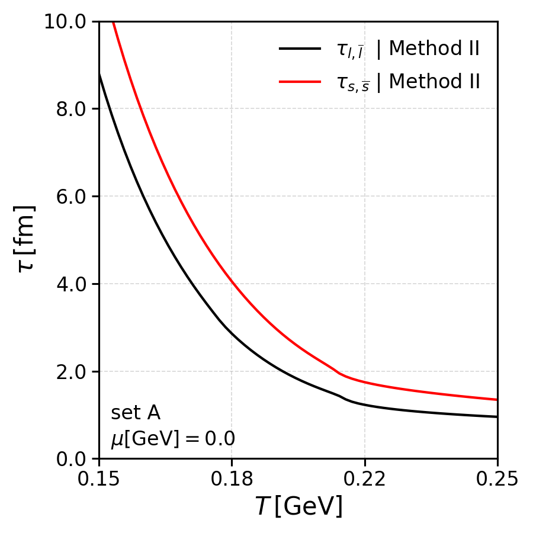
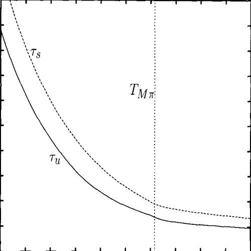
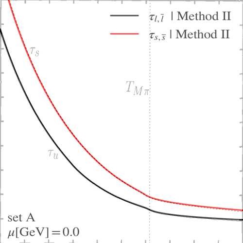
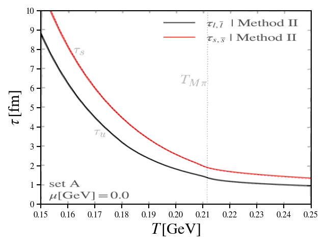

# SU(3) NJL – Klevansky (1996) Reproduction

This folder contains calculations aimed at reproducing the results published on the paper:

P. Rehberg, S. P. Klevansky, and J. Hüfner,  
*Elastic scattering and transport coefficients for a quark plasma in SU_f(3) at finite temperatures*,  
Nuclear Physics A 608 (1996) 356-388.

The goal of this implementation is to validate some features of the present NJL codebase by reproducing key results of the original paper within the SU(3) NJL model using the cutoff scheme and integrations techniques proposed in that work.

In particular, the quark relaxation times are computed and compared against the results reported in the reference.

The code base is used in its entirety except by one fulcral change: in the present code base the 3-momentum sphere intersection regularization is used instead of the usual regularization used in the original paper. The usual way in which the 
3-momentum regularization is performed breaks a symmetry of the system: the quark-antiquark polarization loop, which mixes light and strange quarks, is not symmetric with respect to the interchange of quarks. More details can be found in [New approach to the 3-momentum regularization of the in-medium one- and two-fermion line integrals with applications to cross sections in the Nambu–Jona-Lasinio model](https://arxiv.org/pdf/2310.05749).


## Codebase modifications

Applying this regularization to the quark and antiquark polarization functions implies changing the codebase. Thus, before performing the calculation two steps are made:

- The calculation of the 2-line fermion line integral (B0) used in the codebase is switched to the one implemented in the Nuclear Physics A 608 (1996) paper;

- The polarization functions are changed: the 1-line fermion line integral (A) present in the definitions of these polarization functions is now changed to NOT depend on the external-momentum ($k$ is set to zero);

These changes are made to the local codebase before compilations of the C++ codel, using the `modify_codebase.sh` script which:

- Makes a backup of the relevent files;

- Copies the implementation of the 2-line fermion line integral (B0) using the Klevansky recipe to the proper folder;

- Changes the SU3NJL3DCutoffMesonPropagators.cpp file to use the Klevansky recipe and remove the $k$ dependency of the 1-line fermion line integral (A) to obtain the usual polarization functions;

The script `restore_codebase.sh`, restores the local codebase.

As in other folders in this codebase, the calculations are performed by executing the script `execute_calculations.sh` and the plots are made using the `build_plots.sh`.


## Results

Here we present the results from calculating the quark relaxation times for the light and strange quarks as a function of temperature (a screenshot of the original published figure is included solely for comparison purposes with the data generated by the present codebase.)

<p align="left">
  
</p>

<p align="left">
    
  
</p>

<p align="left">
  
</p>


## Further tests 

The following block can also be added to the `main.cpp` file for debugging purposes:

```C++ 
    #include "njl_model/n_fermion_line_integrals/two_fermion_line_integral_3d_cutoff_klev_recipe.h"

    //parameter set A (Klevansky parameter set)
    double cutoff = 0.6023;
    double gs = 10.116734156126128;
    double kappa = -155.93878816540243;
    double m0u = 0.0055;
    double m0d = 0.0055;
    double m0s = 0.1407;

    //Fix Lagrangian dimensionful couplings
    NJLDimensionfulCouplings couplings(LagrangianInteractions::SP4Q_DET2NFQ, gs, kappa);

    //Create NJL parameter set
    SU3NJL3DCutoffParameters parameters(
        NJL3DCutoffRegularizationScheme::CUTOFF_EVERYWHERE, 
        cutoff, 
        couplings, 
        m0u, 
        m0d, 
        m0s
    );
    parameters.setParameterSetName("setA");

    //solve model in the vacuum
    double gapPrecision = 1E-8;
    SU3NJL3DCutoffVacuum vacuum(parameters);
    vacuum.solve(gapPrecision, HYBRIDS, 0.3, 0.3, 0.5);

    cout << "Vacuum effective masses: \n";
    cout << "testSolution=" << vacuum.testSolution(1E-8) << "\n";
    cout << "Mu=" << vacuum.getUpQuarkEffectiveMass() << "GeV" << "\t" 
         << "Md=" << vacuum.getDownQuarkEffectiveMass() << "GeV" << "\t" 
         << "Ms=" << vacuum.getStrangeQuarkEffectiveMass() << "GeV" << "\n";

    cout << "Pseudoscalar meson masses:\n";

    SU3NJL3DCutoffMeson pionPlusMassSolution = vacuum.calculateMesonMassAndWidth(pionPlus, 1E-7, HYBRIDS, 0.2, 0.2);
    cout << pionPlusMassSolution.getMesonMass() << "\t" << pionPlusMassSolution.getMesonWidth() << "\n";

    SU3NJL3DCutoffMeson kaonPlusMassSolution = vacuum.calculateMesonMassAndWidth(kaonPlus, 1E-7, HYBRIDS, 0.4, 0.2);
    cout << kaonPlusMassSolution.getMesonMass() << "\t" << kaonPlusMassSolution.getMesonWidth() << "\n";

    double sigma_uuuu = integratedCrossSectionProcess12To34Klevansky(
        parameters, 
        0.150, 
        0.0, 
        0.0, 
        0.0, 
        0.303279809165436, 
        0.303279809165436, 
        0.512749442947671, 
        1E-7, 
        ScatteringProcess::UUUU, 
        false, 
        1E-5,
        1E-6, 
        1E-3
    );
    cout << sigma_uuuu << "\n";
    
    gsl_complex test = pseudoscalarPolarizationOperator3DCutoff(
        NJL3DCutoffRegularizationScheme::CUTOFF_EVERYWHERE, 
        cutoff, 
        3.0, 
		0.150, 
        0.0, 
        0.0, 
        0.303279809165436, 
        0.512749442947671, 
		0.1, 
        0.2,
        1E-7
    );
    cout << GSL_REAL(test) << "\n";
	cout << GSL_IMAG(test) << "\n";

    cout << "Using the Klevansky recipe for the B0 integral, these results must match: " << "\n";
    cout << 2.35581 << "\n";
    cout << 0.032256 << "\n";
    cout << -0.00051353 << "\n";
```
