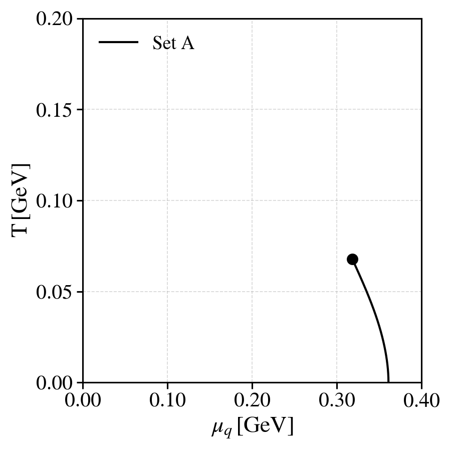
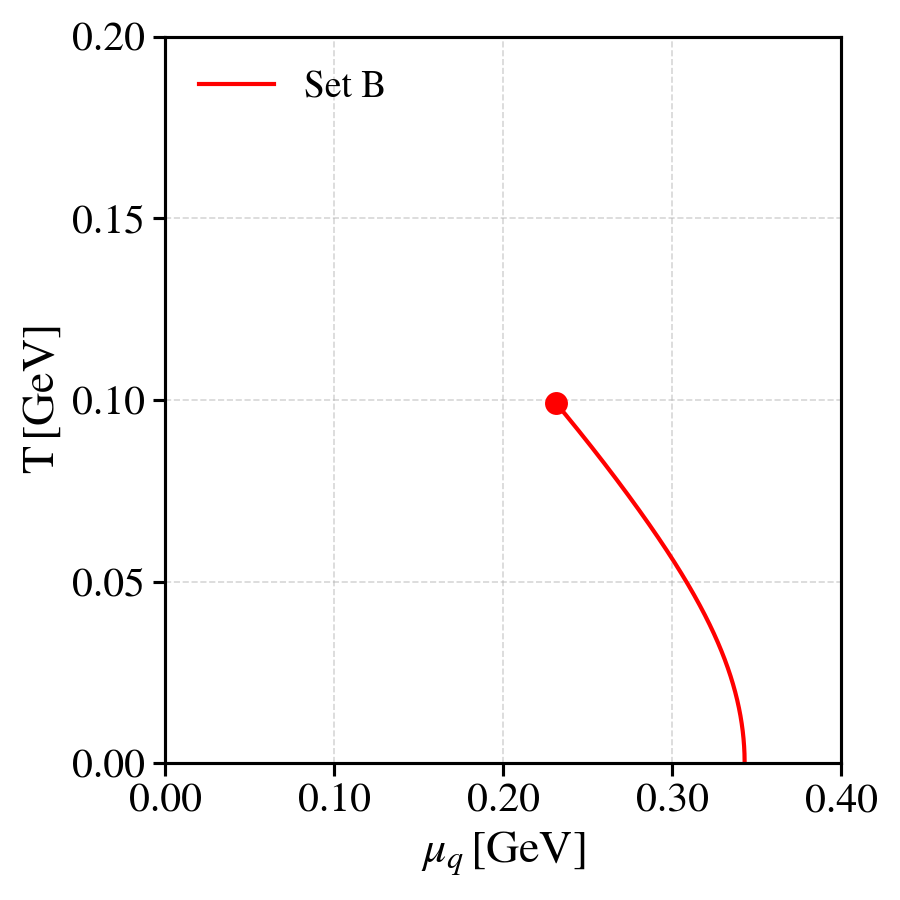
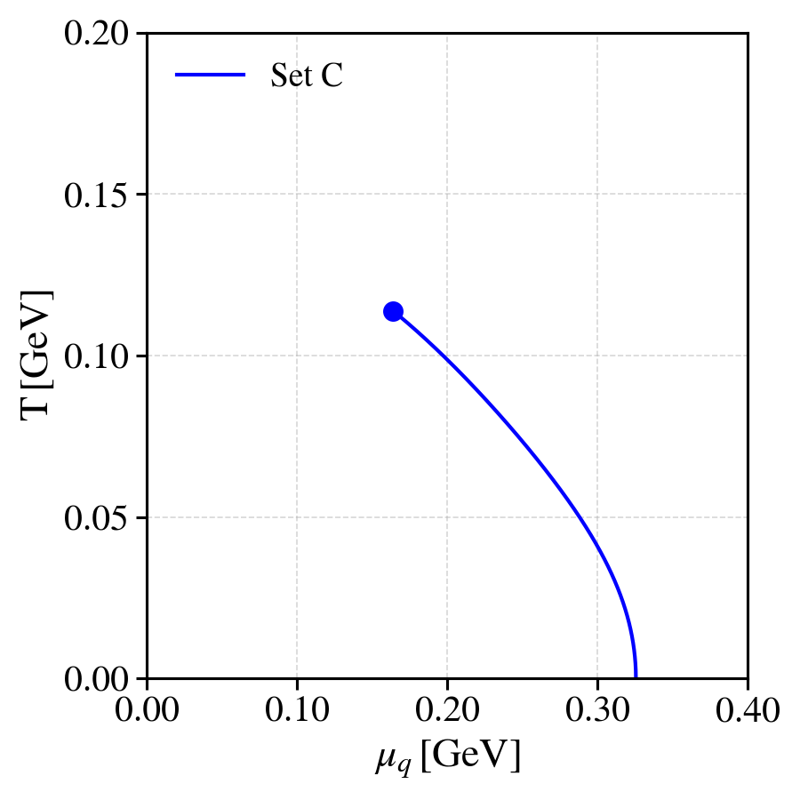
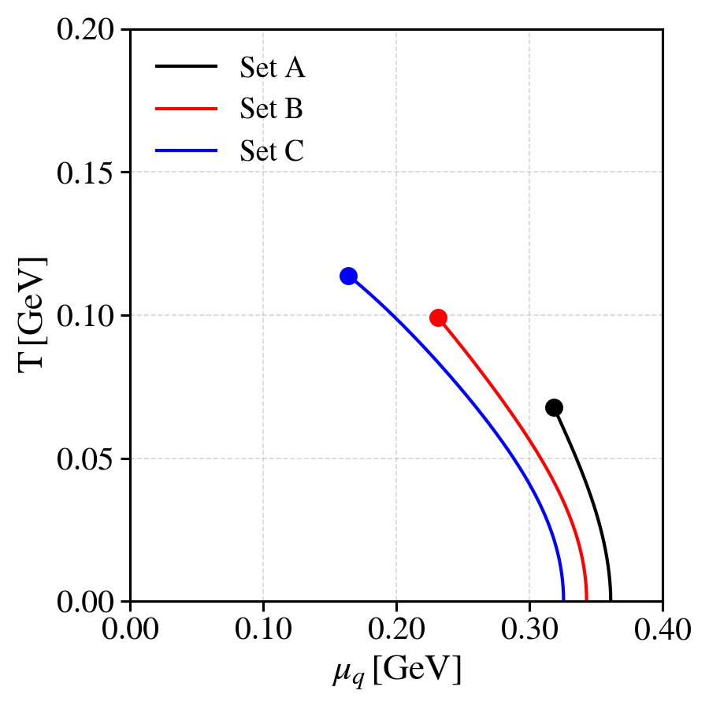
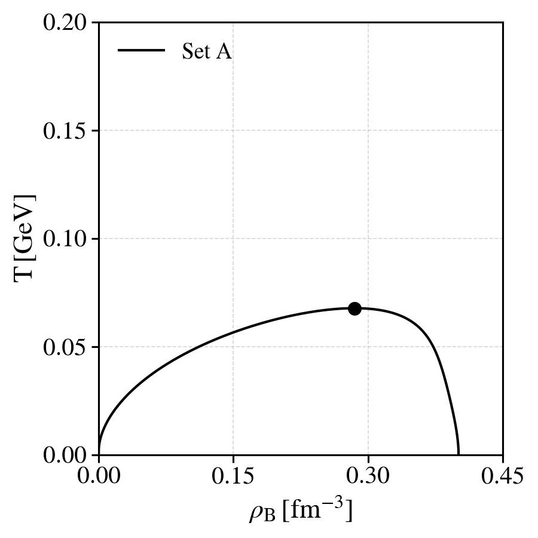
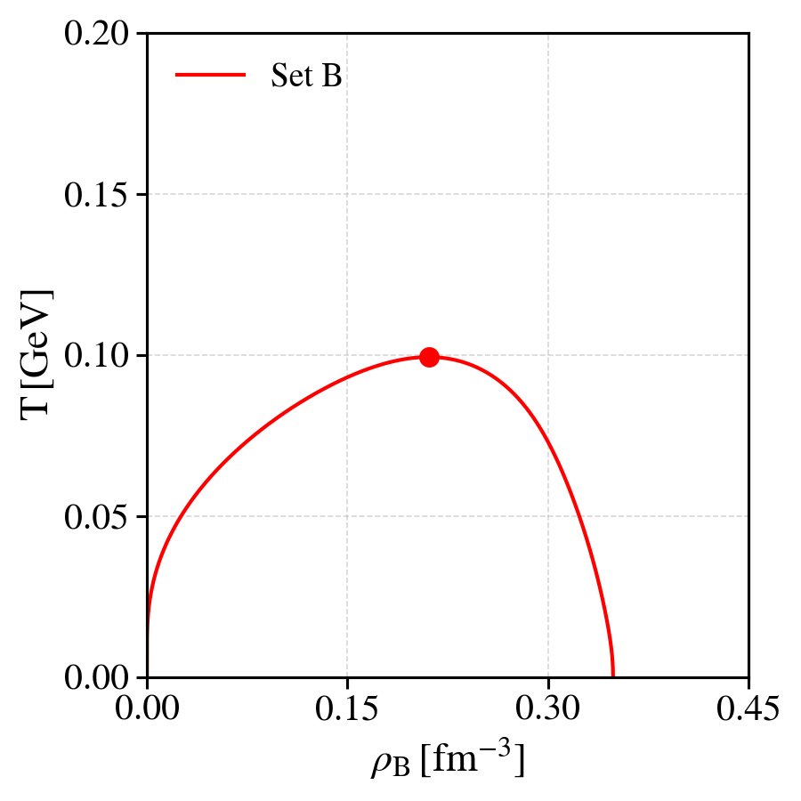
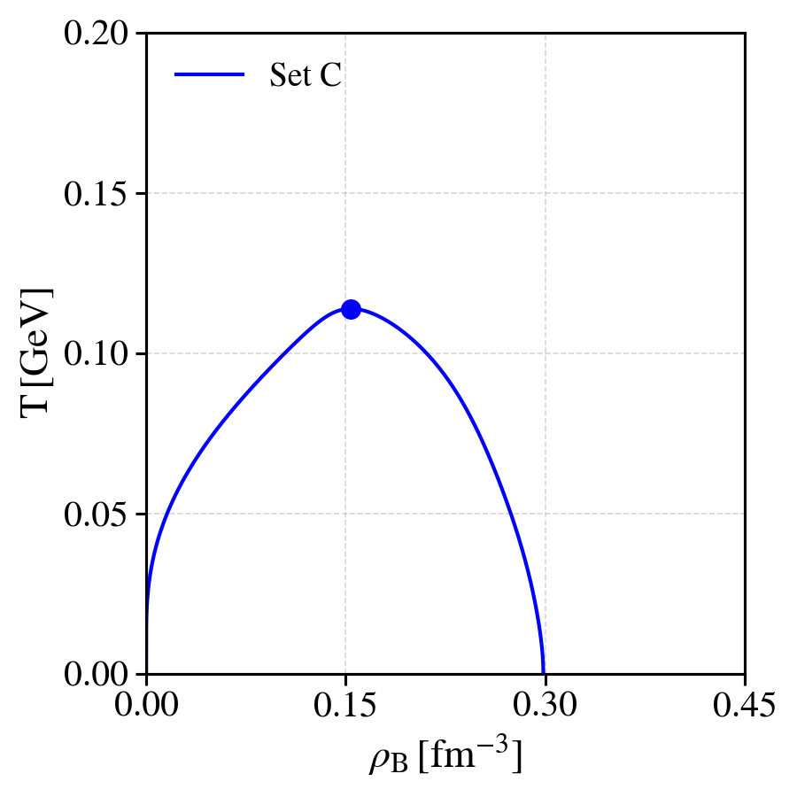
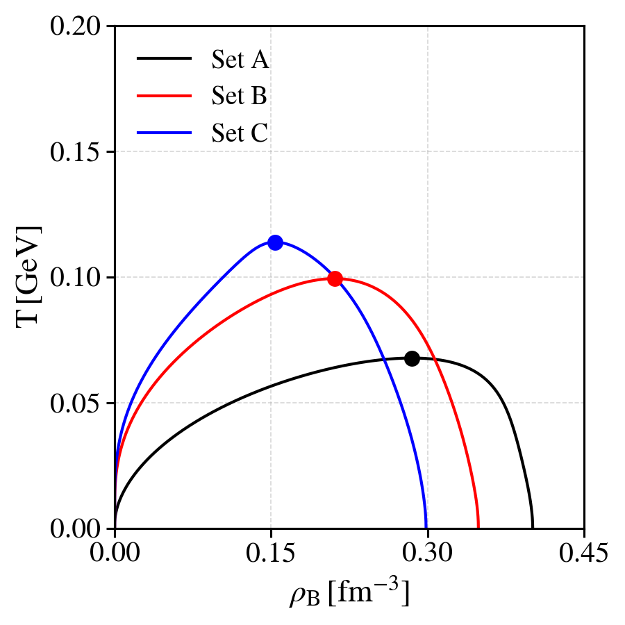

# README

## Overview

This folder contains the necessary scripts, data files, and configuration files to evaluate the phase diagram of the SU(3) NJL model for different parameter sets—specifically without (Set A) and with 8-quark interactions at the Lagrangian level (Sets B and C). 

The NJL parameter set A, is the usual Klevansky parameter set. The NJL parameters given in Sets B and C contain 8-quark interactions. In these sets the coupling $g_1$ was fixed manually and the remaining six free parameters were found by requiring the model to reproduce the masses of the pion ($M_{\pi^\pm} = 0.140 \,\mathrm{GeV}$), the kaon ($M_{K^\pm} = 0.494 \,\mathrm{GeV}$), the eta prime ($M_\eta'= 0.958 \,\mathrm{GeV}$) and $a_0^\pm$ ( $M_{a_0^\pm}= 0.960 \,\mathrm{GeV}$) mesons, the leptonic decays of the pion ($f_{\pi^\pm} = 0.0924 \,\mathrm{GeV}$) and kaon ($f_{K^\pm}=0.094 \,\mathrm{GeV}$). For further details, see [Renan Camara Pereira PhD thesis](https://estudogeral.uc.pt/handle/10316/95294).


## How to run calculations in this folder

The calculations performed in this folder follow the general structure found in this project. The scripts execute the following steps:

1. Navigates to the parent directory and builds the C++ code using `make`.
2. Copies the compiled binary to the appropriate folder.
3. Executes the binary with different `.ini` configuration files.
4. Cleans up the binary after execution.

The calculations can be executed by running:
```bash
(./execute_calculations.sh)
```

After the data itself is created, the plots can be generated by executing the `build_plots.sh` script, which will output plots to the `plots/` folders.

To execute everything in one go:
```bash
./execute_calculations.sh
./build_plots.sh
```


## Results

In this section we show the phase diagram of the NJL for different parameter sets.

<p align="left">
  
  
  
  
</p>

<p align="left">
  
  
  
  
</p>
