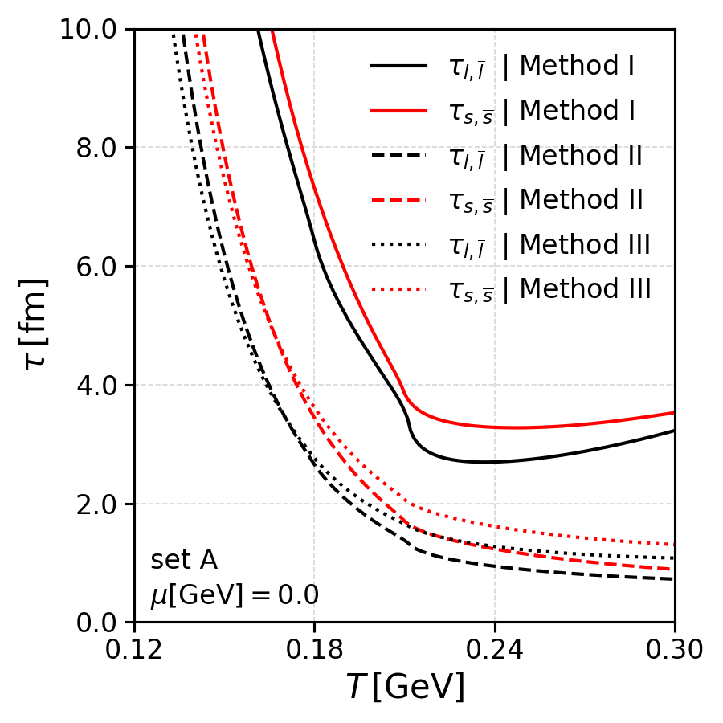
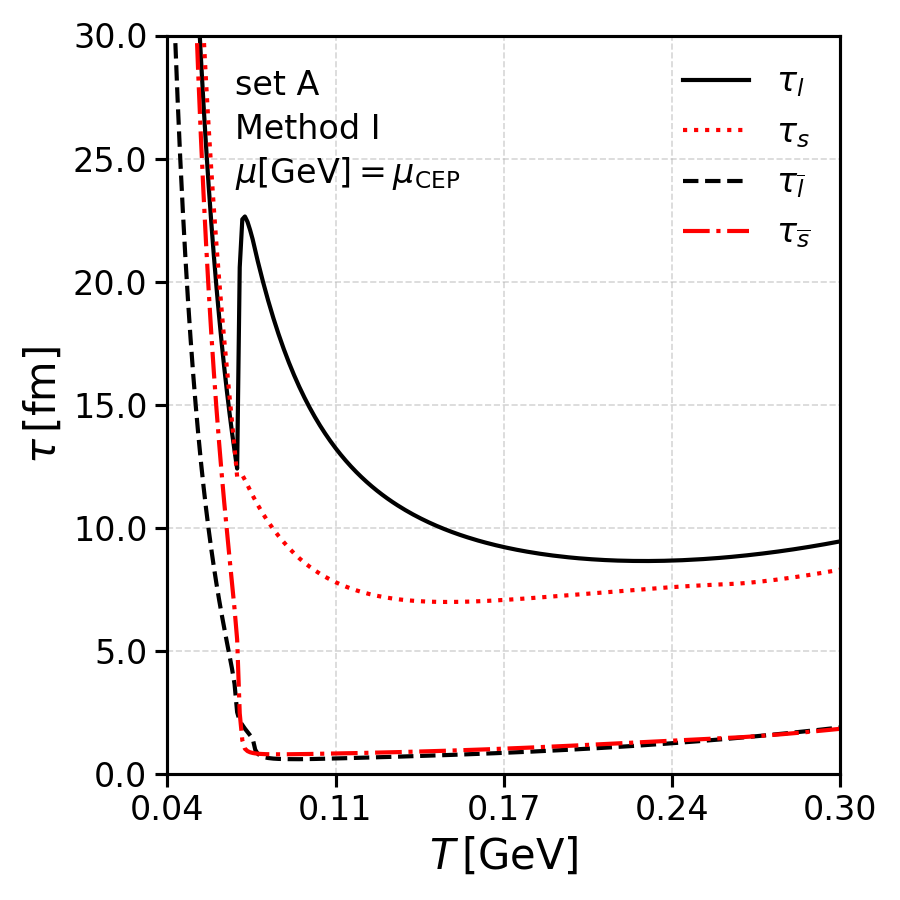
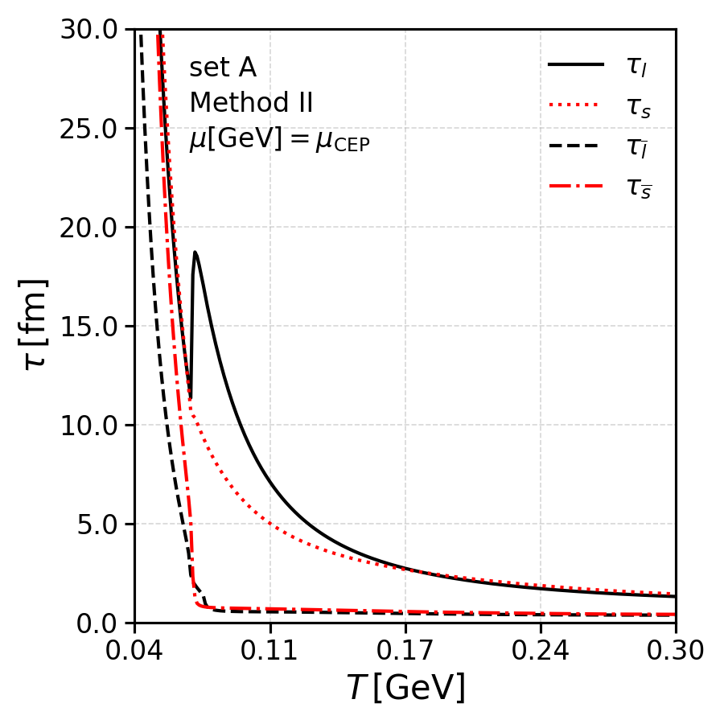
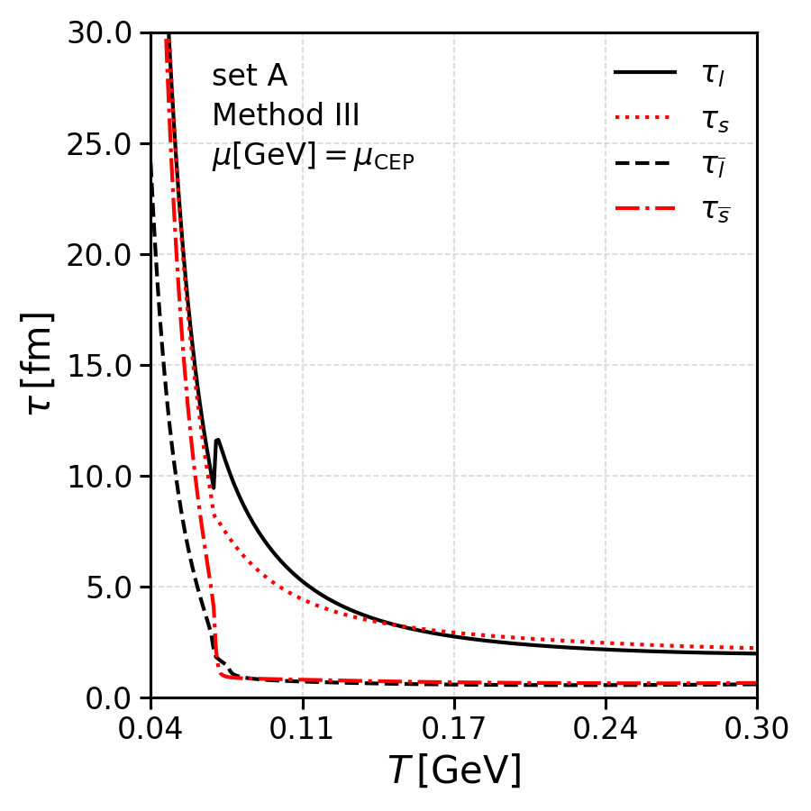
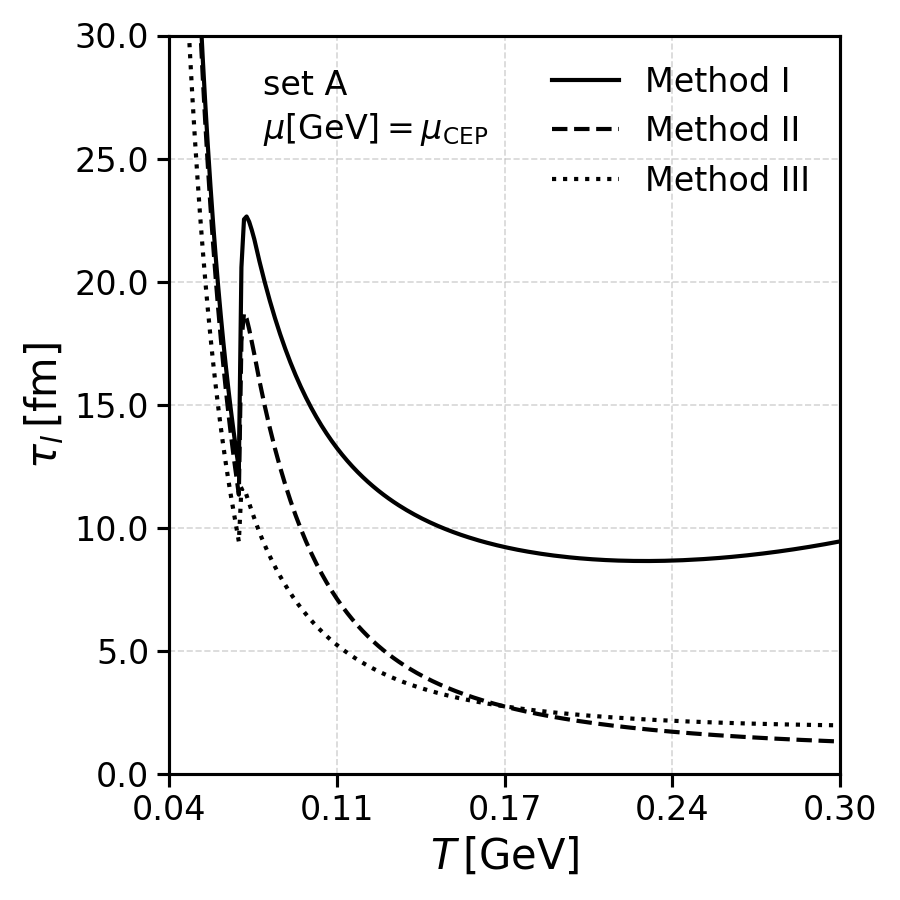
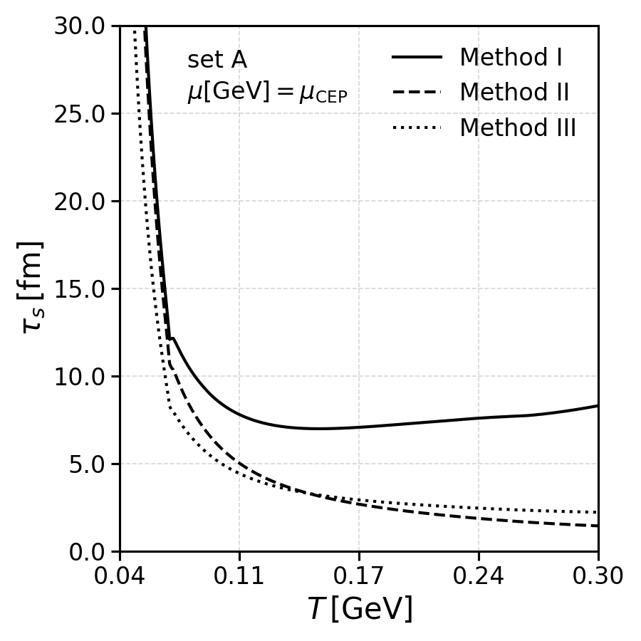
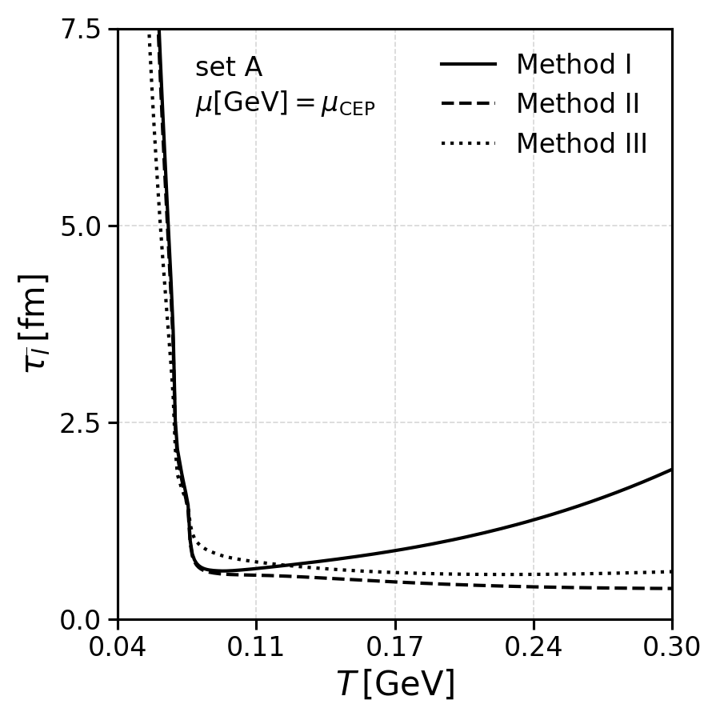
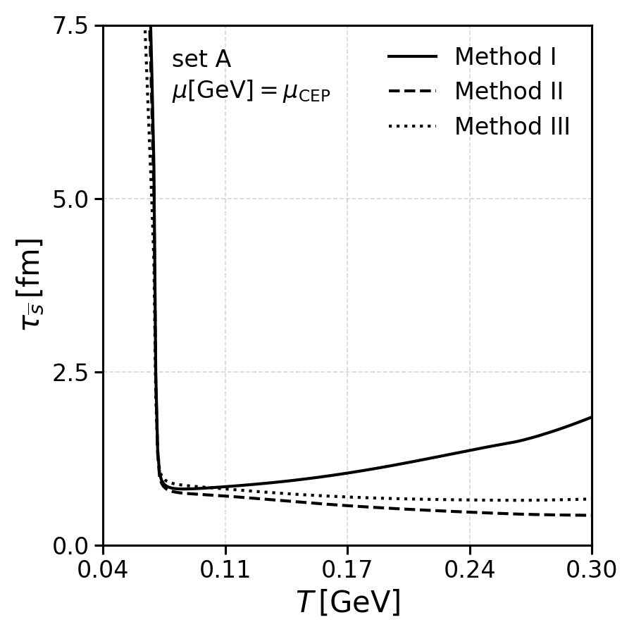

# README

## Overview

This folder contains the necessary scripts, data files, and configuration files to evaluate the quark relaxation time within the context of the SU(3) NJL model for different values of temperature and chemical potential. Additionally, different NJL parameter sets are used, as well as, different methods to evaluate the integral over the differential cross sections, necessary quantities to evaluate the quark relaxation time.

Regarding the parameter sets, we consider sets both without (Set A) and with 8-quark interactions at the Lagrangian level (Sets B and C). The NJL parameter set A, is the usual Klevansky parameter set. The NJL parameters given in Sets B and C contain 8-quark interactions. In these sets the coupling $g_1$ was fixed manually and the remaining six free parameters were found by requiring the model to reproduce the masses of the pion ($M_{\pi^\pm} = 0.140 \,\mathrm{GeV}$), the kaon ($M_{K^\pm} = 0.494 \,\mathrm{GeV}$), the eta prime ($M_\eta'= 0.958 \,\mathrm{GeV}$) and $a_0^\pm$ ( $M_{a_0^\pm}= 0.960 \,\mathrm{GeV}$) mesons, the leptonic decays of the pion ($f_{\pi^\pm} = 0.0924 \,\mathrm{GeV}$) and kaon ($f_{K^\pm}=0.094 \,\mathrm{GeV}$). For further details, see [Renan Camara Pereira PhD thesis](https://estudogeral.uc.pt/handle/10316/95294).

Regarding the different methods to evaluate the integral over the differential cross sections, 4 values are allowed in the code:
- `COMPLETE_OG`
- `COMPLETE_COV` 
- `KLEVANSKY`
- `ZHUANG`

More details about these different methods can be found [here](../su3_3d_cutoff_int_cross_sections/README.md).

## How to run calculations in this folder

The calculations performed in this folder follow the general structure found in this project. The Python code used to evaluate the quark relaxation times can be executed using the following command:
```bash
(./execute_calculations.sh)
```

After the data itself is created, the plots can be generated by executing the `build_plots.sh` script, which will output plots to the `plots/` folders. Use:
```bash
(./build_plots.sh)
```

## Results

In this section we present the results of the quark relaxation time for different physical scenarios, different NJL parameter sets and different methods to evaluate the integral over the differential cross sections.

### Set A, Zero chemical potential

<p align="left">
  
</p>

### Set A, CEP chemical potential

<p align="left">
  
  
  
</p>

<p align="left">
  
  
</p>
<p align="left">
  
  
</p>
