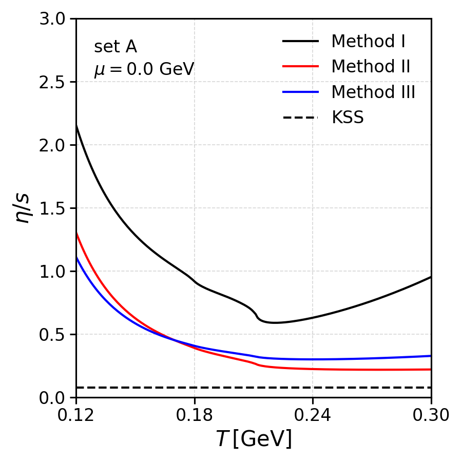

# README

## Overview

This folder contains the necessary scripts, data files, and configuration files to evaluate transport coefficients within the context of the SU(3) NJL model for different values of temperature and chemical potential. Additionally, different NJL parameter sets are used, as well as, different methods to evaluate the integral over the differential cross sections, necessary quantities to evaluate the quark relaxation time which are then used to evaluate the different transport coefficients.

Regarding the parameter sets, we consider sets both without (Set A) and with 8-quark interactions at the Lagrangian level (Sets B and C). The NJL parameter set A, is the usual Klevansky parameter set. The NJL parameters given in Sets B and C contain 8-quark interactions. In these sets the coupling $g_1$ was fixed manually and the remaining six free parameters were found by requiring the model to reproduce the masses of the pion ($M_{\pi^\pm} = 0.140 \,\mathrm{GeV}$), the kaon ($M_{K^\pm} = 0.494 \,\mathrm{GeV}$), the eta prime ($M_\eta'= 0.958 \,\mathrm{GeV}$) and $a_0^\pm$ ( $M_{a_0^\pm}= 0.960 \,\mathrm{GeV}$) mesons, the leptonic decays of the pion ($f_{\pi^\pm} = 0.0924 \,\mathrm{GeV}$) and kaon ($f_{K^\pm}=0.094 \,\mathrm{GeV}$). For further details, see [Renan Camara Pereira PhD thesis](https://estudogeral.uc.pt/handle/10316/95294).

Regarding the different methods to evaluate the integral over the differential cross sections, 4 values are allowed in the code:
- `COMPLETE_OG`
- `COMPLETE_COV` 
- `KLEVANSKY`
- `ZHUANG`

More details about these different methods can be found [here](../su3_3d_cutoff_int_cross_sections/README.md).

### Transport Coefficients

The following transport coefficients are being calculated here: shear viscosity.

The formula being used to evaluate the shear viscosity is given by:
$
\begin{equation}
\eta [T,\mu] = \frac{2 N_c}{ 15 T} \sum _{i=q,\overline{q}} \int \frac{d^3 \bm{p}}{(2 \pi )^3} \frac{\bm{p}^4}{E_i^2} \tau_i [T,\mu]  n_{\textrm{F}}[T,E_i - \xi \mu] \big( 1 - n_{\textrm{F}}[T,E_i - \xi \mu] \big),
\end{equation}
$
here, $E_i \equiv E_i[\bm{p}, M_i] = \sqrt{\bm{p}^2 + M_i^2}$ and $n_{\textrm{F}}$ is the Fermi distribution function:
$
\begin{equation}
n_{\textrm{F}}[T,E] = \frac{1}{ \exp[E/T] - 1 } .
\end{equation}
$


### Folder Structure
```
.
├── README.md                           # This file
├── build_plots.sh                      # Shell script to build plots
├── __init__.py                         # Python file necessary to modularize
├── compute_shear_viscosity.py          # Python code used to calculate the shear viscosity
├── data                                # Contains input .ini files and generated data files
│   ├── *.dat                           # Generated data files
├── execute_calculations.sh             # Shell script to execute the calculations
├── plotting                            # Python scripts for generating plots
│   ├── build_plots_*.py                # Specific plot scripts for various scenarios
│   ├── __init__.py                     # Python file necessary to modularize
├── plots                               # Directory to store the generated plot images
│   ├── *.png                           # Output plot files
```

### Prerequisites
- Ensure the necessary build tools and compilers are installed (e.g., `make` and a C++ compiler).
- Python 3.x must be installed along with the required libraries for plotting (e.g., `matplotlib`, `numpy`).

## How to Use

### Step 1: Execute Calculations
Execute the Python code used to evaluate the transport coefficients. This can be done by executing the script `execute_calculations.sh`.

### Step 2: Generate Plots
Run the `build_plots.sh` script to generate the plots based on the generated data files.
```bash
./build_plots.sh
```

## Output
- **Data files**: Stored in the `data` directory, with `.dat` extensions.
- **Plots**: Saved in the `plots` directory, with `.png` extensions.

## Notes
- Ensure that the `plots` and `data` directories are writable by the scripts.


### Example Commands

To execute everything in one go:
```bash
./execute_calculations.sh
./build_plots.sh
```

## Results

In this section we present the results for some transport coefficients for different physical scenarios, different NJL parameter sets and different methods to evaluate the integral over the differential cross sections.


### Shear Viscosity - Zero chemical potential

<p align="center">
  
  
</p>

