# README

## Overview

This folder contains the necessary scripts, data files, and configuration files to evaluate transport coefficients within the context of the SU(3) NJL model for different values of temperature and chemical potential. Additionally, different NJL parameter sets are used, as well as, different methods to evaluate the integral over the differential cross sections, necessary quantities to evaluate the quark relaxation time which are then used to evaluate the different transport coefficients.

Regarding the parameter sets, we consider sets both without (Set A) and with 8-quark interactions at the Lagrangian level (Sets B and C). For more details about the different parameter sets, see [here](../su3_3d_cutoff_phase_diagram/README.md).

Regarding the different methods to evaluate the integral over the differential cross sections, 4 values are allowed in the code:
- `COMPLETE_OG`
- `COMPLETE_COV` 
- `KLEVANSKY`
- `ZHUANG`

More details about these different methods can be found [here](../su3_3d_cutoff_int_cross_sections/README.md).

### Transport Coefficients


#### Shear Viscosity

The formula being used to evaluate the shear viscosity is given by:
$
\begin{equation}
\eta [T,\mu] = \frac{2 N_c}{ 15 T} \sum _{i=q,\overline{q}} \int \frac{d^3 \bm{p}}{(2 \pi )^3} \frac{\bm{p}^4}{E_i^2} \tau_i [T,\mu]  n_{\textrm{F}}[T,E_i - \xi \mu] \big( 1 - n_{\textrm{F}}[T,E_i - \xi \mu] \big),
\end{equation}
$
here, $E_i \equiv E_i[\bm{p}, M_i] = \sqrt{\bm{p}^2 + M_i^2}$ and $n_{\textrm{F}}$ is the Fermi distribution function:
$
\begin{equation}
n_{\textrm{F}}[T,E] = \frac{1}{ \exp[E/T] - 1 } .
\end{equation}
$


## How to run calculations in this folder

The calculations performed in this folder follow the general structure found in this project. The Python code used to evaluate the transport coefficients can be executed using the following command:
```bash
(./execute_calculations.sh)
```

After the data itself is created, the plots can be generated by executing the `build_plots.sh` script, which will output plots to the `plots/` folders. Use:
```bash
(./build_plots.sh)
```

At this point, two specific scenarios are considered:
- trajectory of increasing temperature and zero chemical potential;
- trajectory of increasing temperature and chemical potential fixed to the critical endpoint (CEP) for that corresponding model;


## Results

In this section we present the results for some transport coefficients for different physical scenarios, different NJL parameter sets and different methods to evaluate the integral over the differential cross sections.


### Shear Viscosity - Zero chemical potential

<p align="center">
  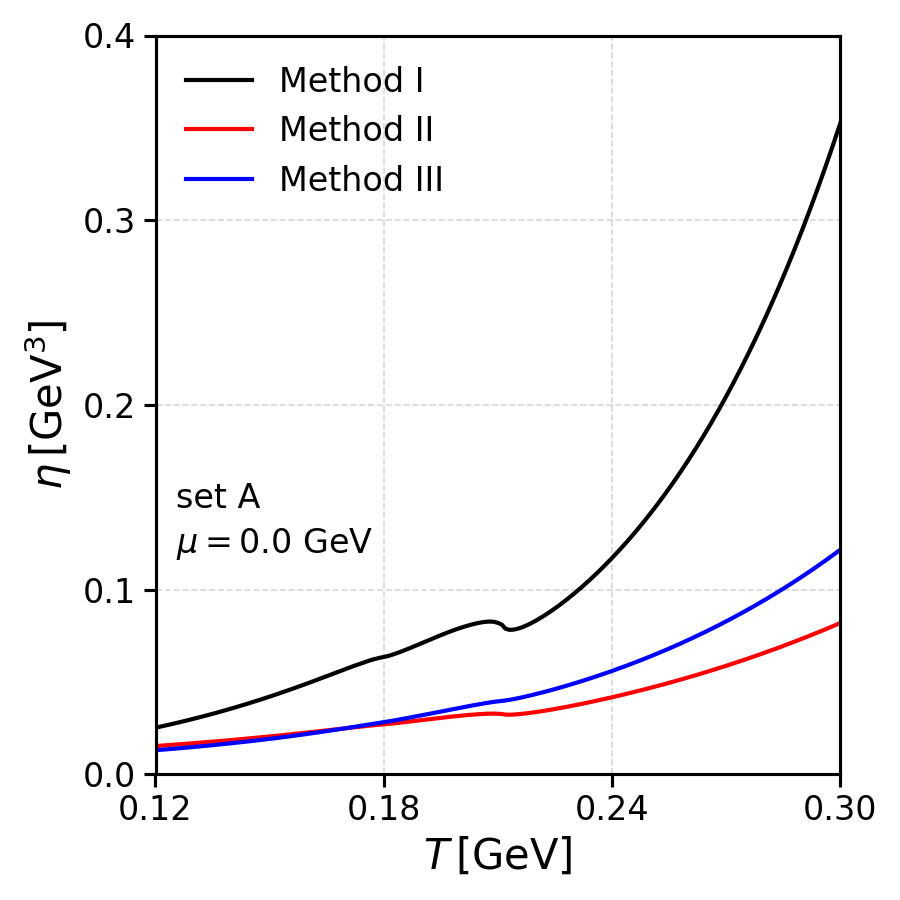
  
</p>

### Shear Viscosity - CEP chemical potential

<p align="center">
  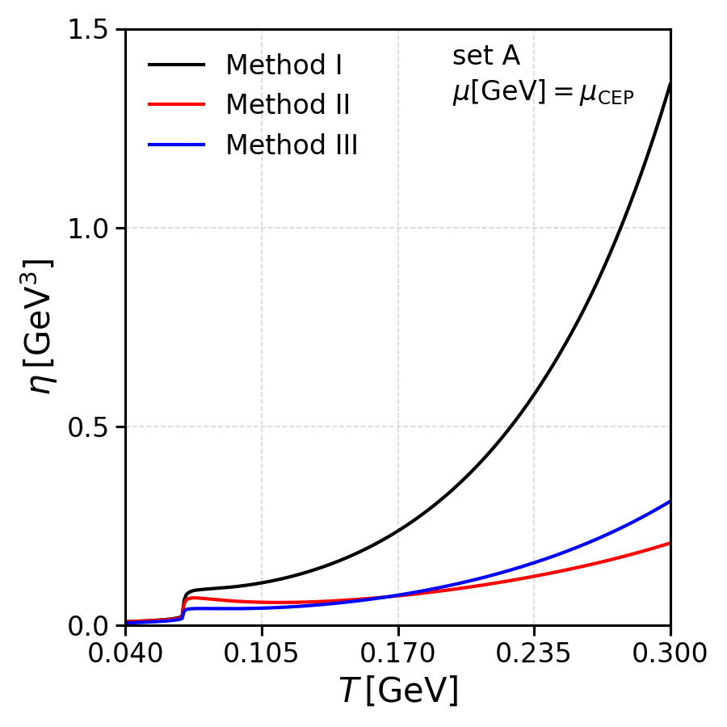
  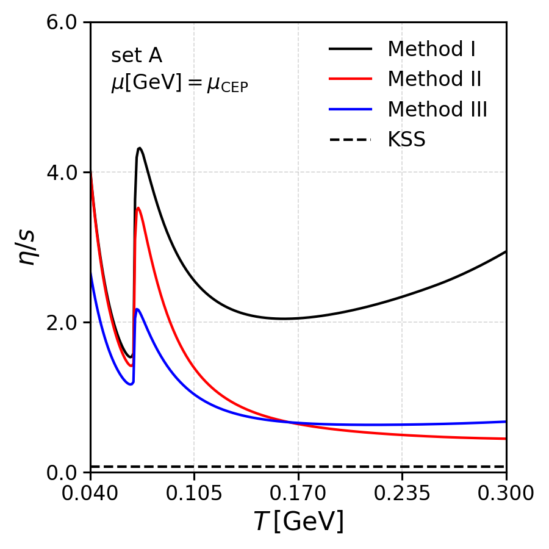
</p>

### Electrical Conductivity - Zero chemical potential

<p align="center">
  
  
</p>

### Electrical Conductivity - CEP chemical potential

<p align="center">
  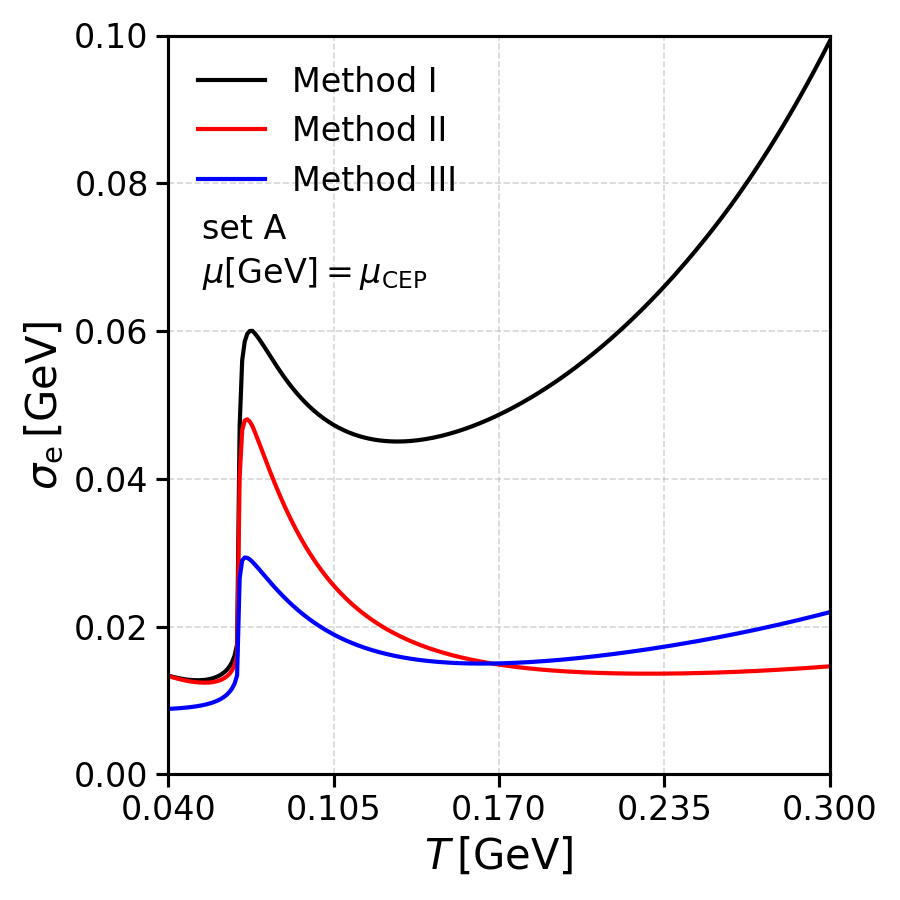
  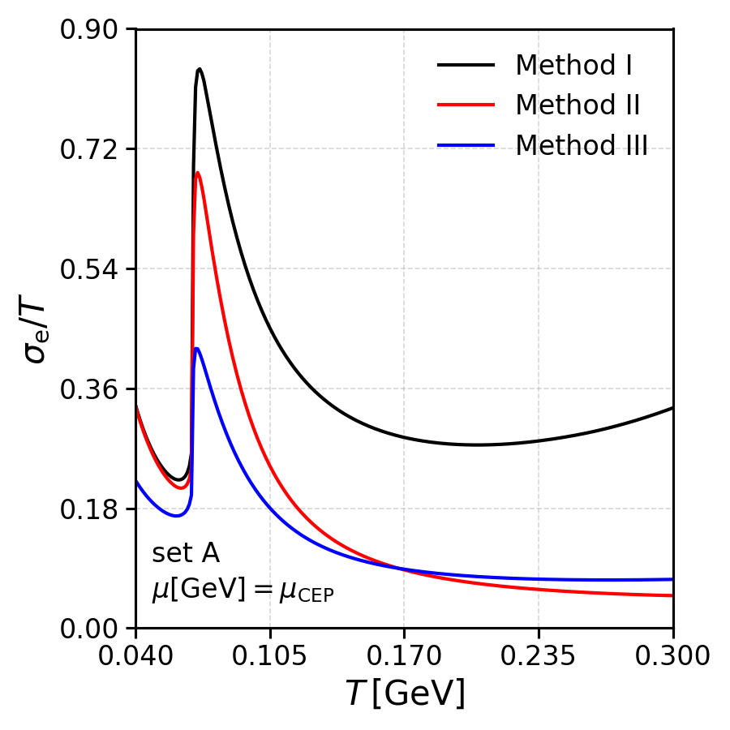
</p>

### Shear Viscosity and Electrical Conductivity Ratios - Zero chemical potential

<p align="center">
  
  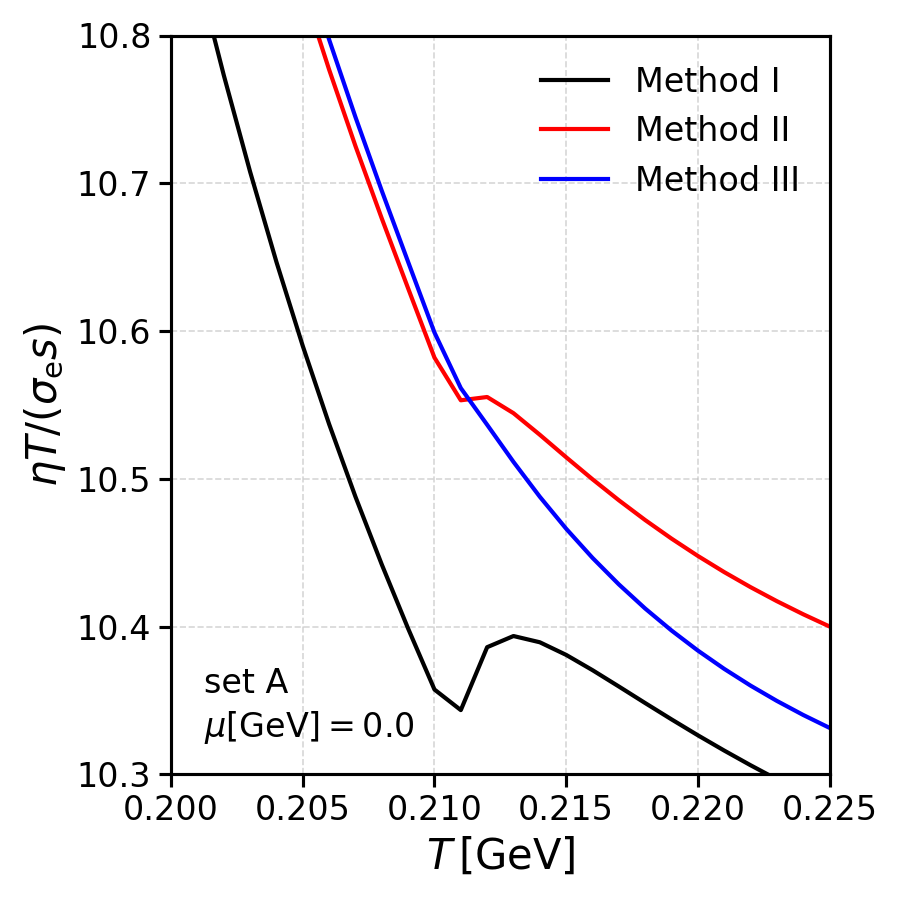
</p>

<p align="center">
  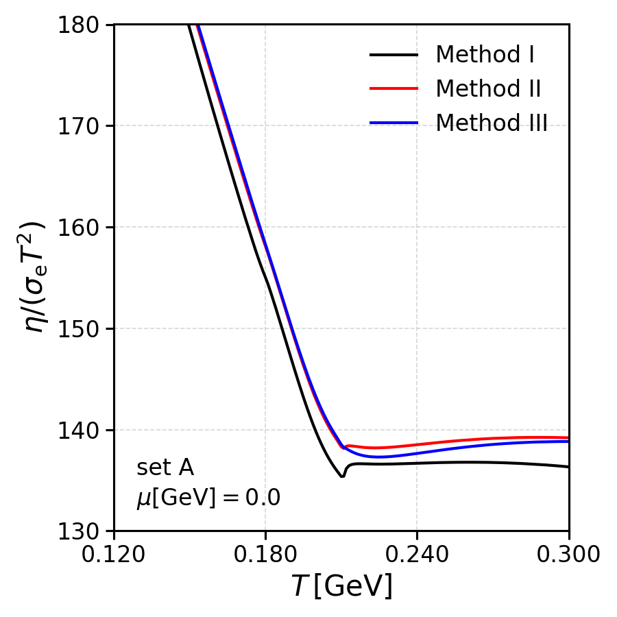
  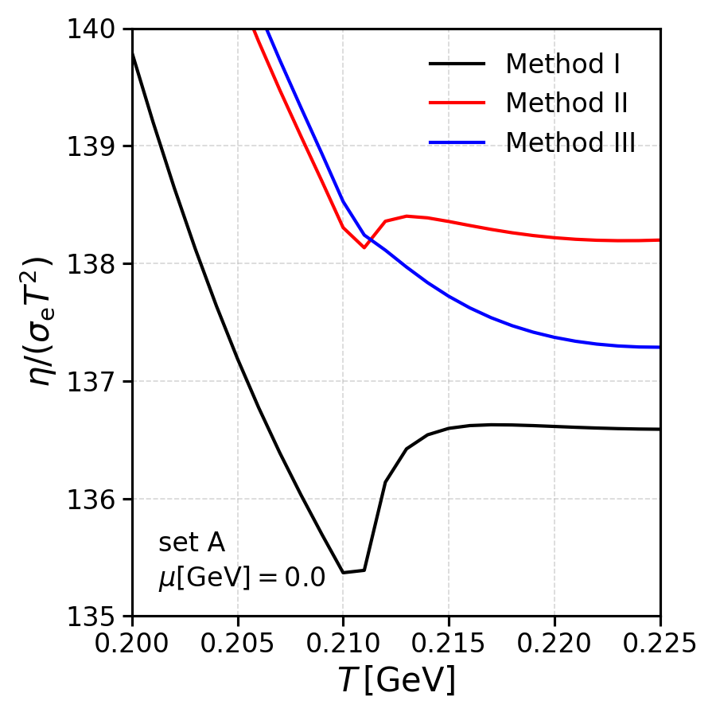
</p>

### Shear Viscosity and Electrical Conductivity Ratios - CEP chemical potential

<p align="center">
  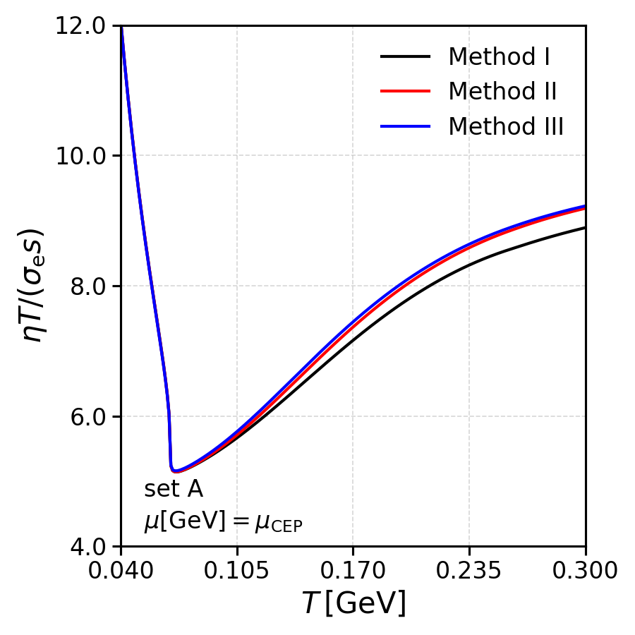
</p>

<p align="center">
  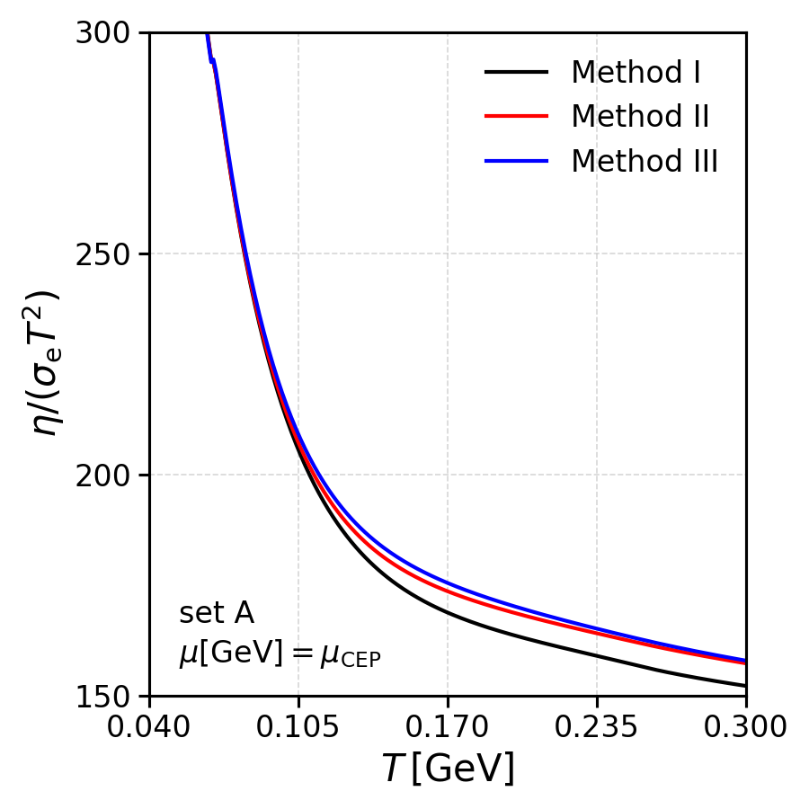
  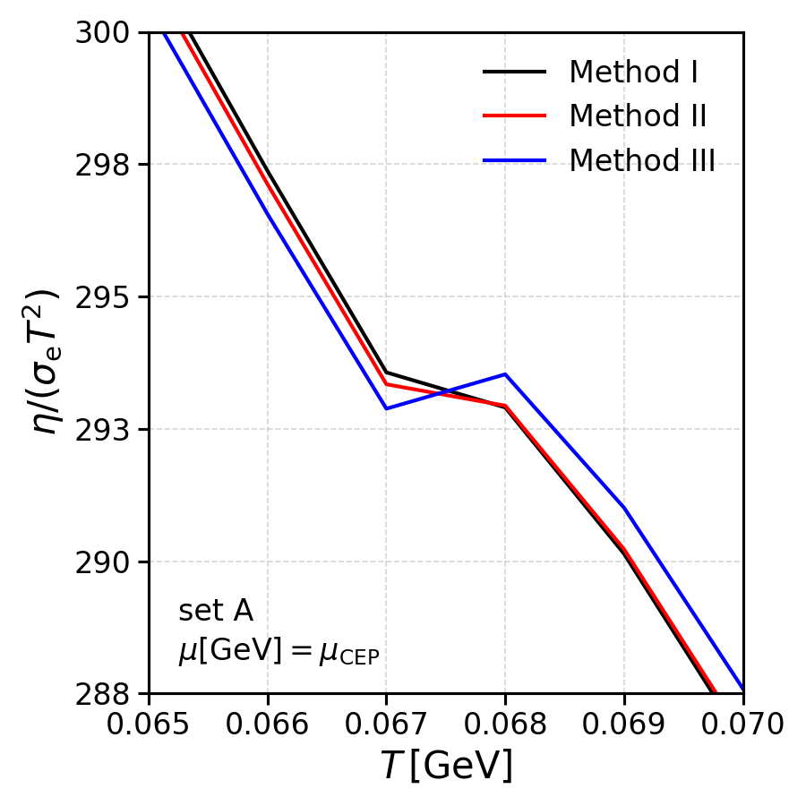
</p>
